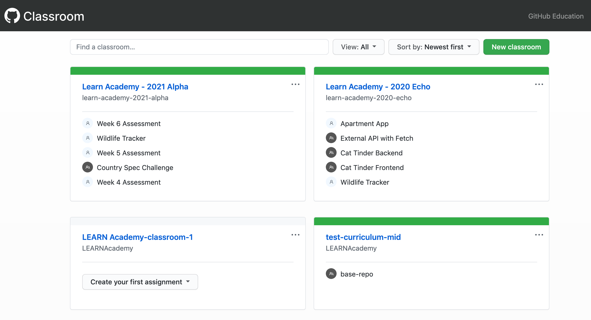

## Instructor Tools
[ Back to Main Handbook ](./README.md#instructor-handbook)

### Slack

Slack is the main channel of communication within LEARN. You will use it to coordinate both with staff and students.

LEARN Staff has a paid Slack account that is separate from the community account.

The dedicated instructor channel is here: 
- [ Teachers Channel ](https://app.slack.com/client/TV83K2TV0/C010CSRCT40)

The general channel is for all staff communication:
- [ General Channel ](https://app.slack.com/client/TV83K2TV0/CV83K3AH0)

There is a channel that connects LEARN with Notch8's Slack account. This can be used for direct messages to anyone on the Notch8 team as well as requesting assistance from the Notch8 developers.
- [ LEARN-Notch8 Channel ](https://app.slack.com/client/TV83K2TV0/C010VGJFPCJ)

The LEARN community account will hold all the cohort channels as well as the *everybody* channel. The *everybody* channel connects all alumni, current students, staff, and community partners.
- [ Everybody Channel ](https://app.slack.com/client/T04B40L2C/C04B40L4U)

You will eventually join other channels as well including various cohort channels and the channels created by students entering capstone projects.

### Zoom

Zoom is for video conferencing. 

For steps on setting up breakout rooms, hosting, etc: [ Zoom ](./managing-zoom.md)

### GitHub

All the course materials live on GitHub. For each cohort, a [GitHub organization](https://git-scm.com/book/en/v2/GitHub-Managing-an-organization) is created to contain all repositorities associated with the cohort. 
On the first day, the only repository that is forked in the organization is [Syllabus](https://github.com/LEARNAcademy/Syllabus).

### GitHub Classroom

[GitHub Classroom](https://classroom.github.com/) allows us to track student work throughout the course and its use allows students to practice working with Git and GitHub. As an instructor, upon logging in, you should be able to see the classrooms you have access to. If you do not see any classroom(s) on your dashboard, please ask to be added to the appropriate classroom(s).

When assignments are created, a link is generated for each GitHub user associated with the classroom.  When a student accepts the assignment by clicking the link, a name-spaced repo for that assignment/project is cloned within the cohort organization for that specific student.

#### GitHub Classroom Assignments

There are two main categories of GitHub Classroom assignments:

1. Assessments (Individual assignments): 
     1. [Week-1-Assessment](https://github.com/LEARNAcademy/Week-1-Assessment)
     2. [Week-2-Assessment](https://github.com/LEARNAcademy/Week-2-Assessment)
     3. [Week-3-Assessment](https://github.com/LEARNAcademy/Week-3-Assessment)
     4. [Week-4-Assessment](https://github.com/LEARNAcademy/Week-4-Assessment)
     5. [Week-5-Assessment](https://github.com/LEARNAcademy/Week-5-Assessment)
     6. [Week-6-Assessment](https://github.com/LEARNAcademy/Week-6-Assessment)
     7. Treasure Hunt Challenge
     8. Wildlife Tracker
     9. Apartment App
2. Projects (Group assignments): 
     1. Tic Tac Toe
     2. Text-based Game Challenge
     3. Pig Latin
     4. Magic8 Ball Challenge
     5. External API with Fetch
     6. Cat Tinder Frontend
     7. Cat Tinder Backend

##### Creating a GitHub Classroom Assignment
To create a GitHub Classroom assignment with starter code, it must be a stand alone repository in the LEARN Academy Organization. A GitHub Classroom assignment can be created without starter code as well.

Steps: 
1. Fork the repo into the cohort's organization on GitHub (Note: the starter code repository cannot be tied to any other repository).  
2. Add the GitHub Classroom link to accept the assignment to the repo description.
3. Be sure to include a README for the assignment that documents any terminal commands needed to get the project spun up and a link to the relevant Syllabus materials. 

### Google Drive

Google drive contains many of the documents related to non-curriculum related tasks. It contains documents to help you track lesson plans, inventory, first day schedules, and a host of other things.

There are two main Google Drives:

1. Administrative: Documents related to organizing the class (e.g. lesson plan calendar, attendance, pairing, surveys, assessment reviews, etc)
2. LEARNers Cohort: Documents/resources for students to have access to (e.g. link to lecture videos, retrospective notes, sign-up sheets)

### Trello

Trello is a Kanban board, task tracker.

For instructors, tasks/projects outside of the classroom are documented in Trello. 
Trello is also used for student project management for Capstone projects. 

There are four main boards:
1. [ Events ](https://trello.com/b/ofzfjXLM/events) tracks all LEARN events: specifically evening/weekend workshops that instructors will be leading have their own cards 
2. [ Jumpstart ](https://trello.com/b/BYycV15b/jumpstart): for each Jumpstart, a copy of the "Master To Do Checklist" is created and tasks within this checklist are used to prepare for the weekend
3. [ Classroom Admin Trello Board ](https://trello.com/b/dQBMlYpI/classroom-admin): tasks around curriculum updates. Please read through [Classroom Admin ReadMe](./classroom-admin-trello.md) to get an understand of how masterlists are used.

Other boards:
- [ Career Services & Internship ](https://trello.com/b/Xl22q6Ry/career-services-internship)
- [ Marketing ](https://trello.com/b/q2s0uEzR/marketing)
- [ Operations ](https://trello.com/b/saxLJBxV/operations)

### HubSpot

HubSpot is LEARN's CRM (Customer Relationship Management) used to track student communication, progress, and interactions from their initial contact with LEARN all the way through job placement. As an instructor, you are responsible for adding notes detailing the one-on-one meetings that take place four times within each cohort: the week before the cohort begins, Week 3, Week 9, and Week 12.

To access HubSpot you will need to be granted access by the LEARN admin staff.

For information on navigating HubSpot and which fields we used to document information: [Tracking Student Progress in HubSpot](./student-progress-hubspot.md)

### YouTube

LEARN uses YouTube to capture lessons using Live Events.

Here is a link to the steps to creating a Live Event: [Creating YouTube Live Events](./youtube-live-events.md)

**Note for Remote:** Here is a link to the steps to uploading lectures from Zoom: [Adding Lectures to YouTube](./recording-lecture.md)

### Live Captioning

In order to provide live captions of lectures a web service is used. [Web Captioner](https://webcaptioner.com/captioner) site will caption the speaking live during the event through the standard microphone.  The web captioner only works with Google Chrome Browsers.  To include captions in the OBS live stream click the 3 dots next to Start Captioning and select New Window. Adjust the new window to fit in the OBS screen by dragging the edges of the new window.  It has already been added to the OBS feed as Captions.  Information on [Terms of Service](https://webcaptioner.com/terms-of-service/) and [Privacy Policy](https://webcaptioner.com/privacy-policy/).

[ Back to Main Handbook ](./README.md#instructor-handbook)

### Gusto

Gusto is the payroll, benefits, HR platform.

For hourly employees, you'll need to track hours daily.
On here, you can request paid-time off, vuew paystubs, make benefit elections.
