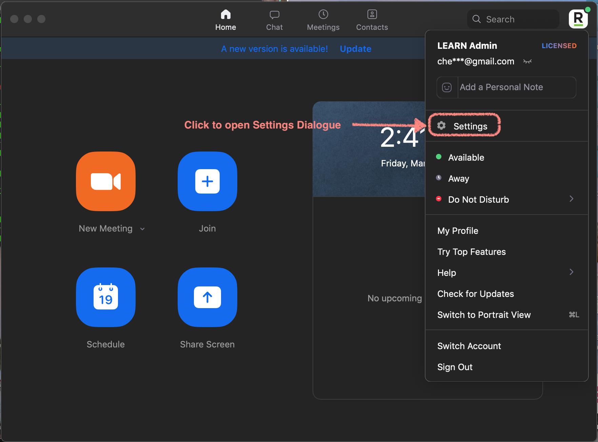
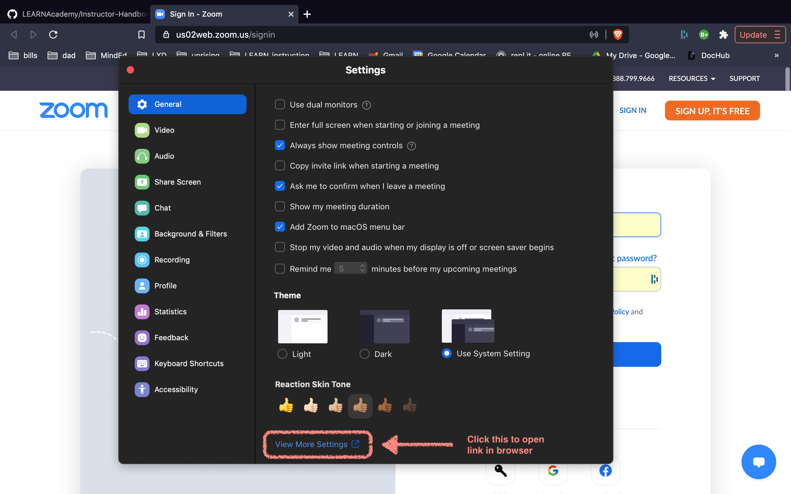
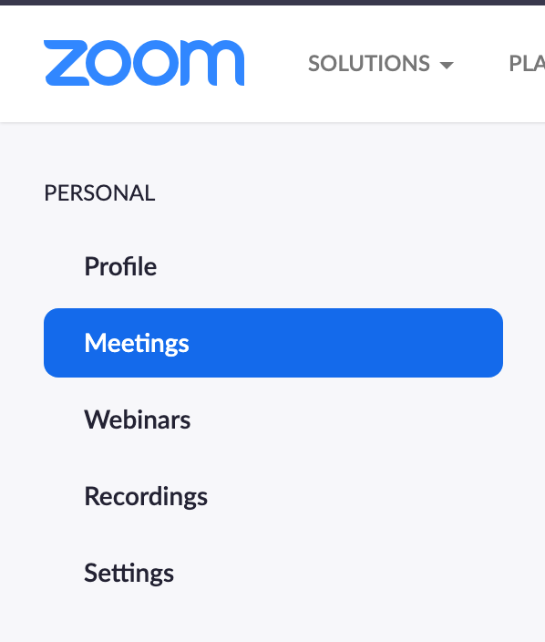
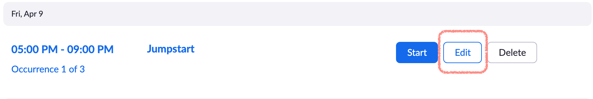
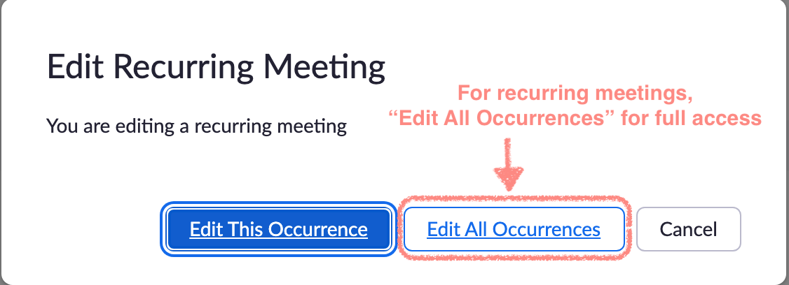
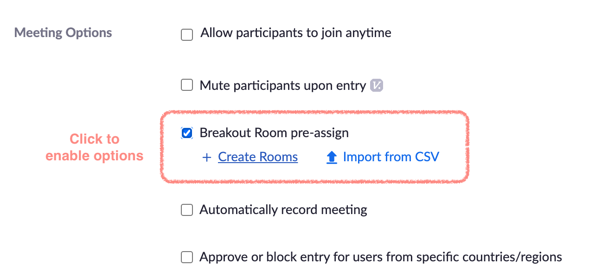
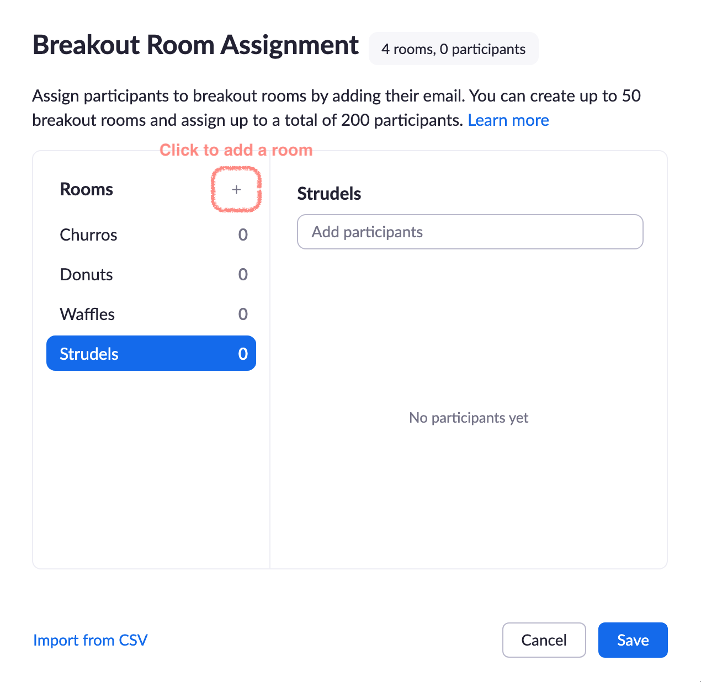
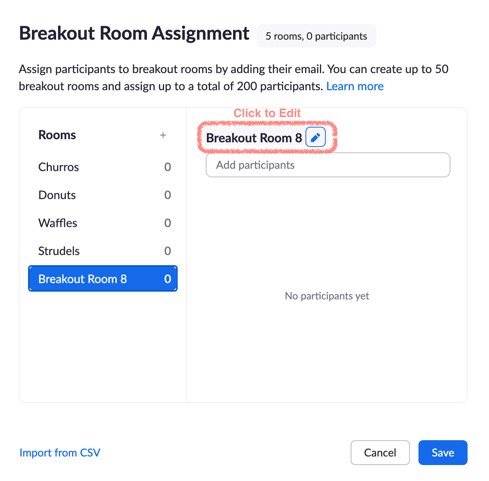

## Zoom

Behind the scenes of managing a Zoom Meeting can be quite overwhelming.
An assumption being made here: that you've installed Zoom Desktop application onto your computer.

To create Breakout Rooms prior to a meeting (such as Jumpstart):

- Sign into your account through the desktop application

- Click your account avatar to open menu

- Click "Settings" to open a Settings dialogue

- Click "View More Settings" to open a tab in your browser for more settings controls for meetings

- In the Settings within the browser, click "Meetings" on the left side menu.

- Zoom Meetings are usually created by Operations Manager and associated with emails and marketing material, so search for the applicable meeting and click "Edit".

- For recurring meetings, there are limited edit capabilities if you select are trying to only edit on instance. For things like create Breakout Rooms, you'll need to click "Edit All Occurrences"

- Scroll down on the main menu and look for "Meeting Options". Check the "Breakout Room pre-assign" to create rooms.

- A modal titled "Breakout Room Assignment" should appear. Click the tiny plus button near "Rooms" to generate a room.

- Click the generated room to enable options to edit the room name. Click the room name to edit.

- Make sure to click Save on the "Breakout Room Assignment". Failure to do so will erase all rooms created.

- At this point, for Jumpstart, we do not actually assign the participants because we will not have access to their Zoom user accounts. We assign participants to rooms while the Zoom meeting is in session.

### Managing Breakout Rooms

- [This video is helpful.](https://youtu.be/jbPpdyn16sY)

### Host and Co-Host Powers

- [This video is also helpful.](https://youtu.be/ygZ96J_z4AY)

### Recording

- Select the "Record to Cloud" option.