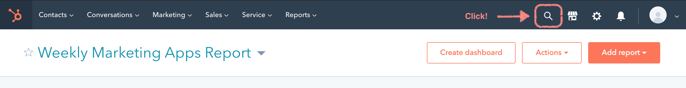
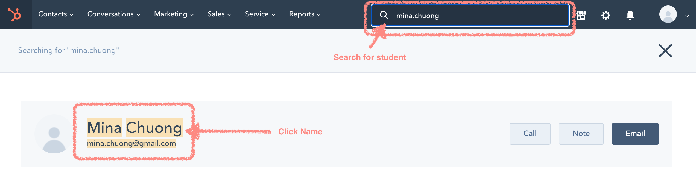
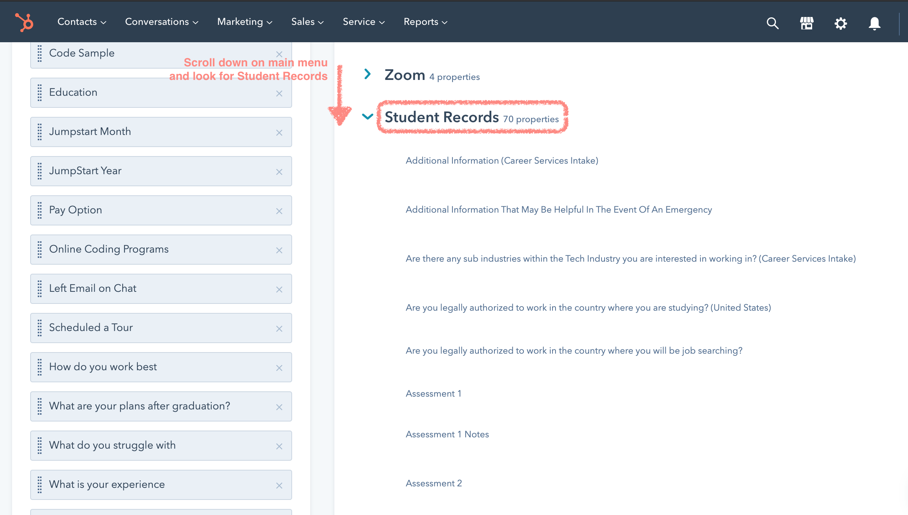

## Instructor Usage of HubSpot

The main things that get tracked are:
- Notes taken for each student during a one-on-one
- Assessment feedback and notes (from a Google Doc)
- Attendance (from a Google Doc)
- Capstone Project Info

### To input One-on-one notes 

Note: These are input directly into Hubspot.

Go to [www.hubspot.com](www.hubspot.com)

- Click the magnifying glass icon

- Search for the appropriate student in the search bar by name

- On the left hand column, scroll down to `view all properties`

- Identify the Student Records section

- Input one-on-one notes, including your name and the date the one-on-one took place

- Save! 
- Pro-tip: The save button is strangely unreliable so as you're taking notes during one-on-ones, it might be safer to do it in a Google Document or somewhere where you have it kept safely for backup because HubSpot has a tendency to not save input sometimes.
- Refresh window to ensure the notes are saved. 

### To input Assessment notes, Absences, Capstone Project Info

At the end of a cohort, [this form](https://share.hsforms.com/1Y9Zh_3M4SdKxVcrRAWzFGQ1bve2) is used to input data into Hubspot.

This task is tracked within the Classroom Admin Trello board.