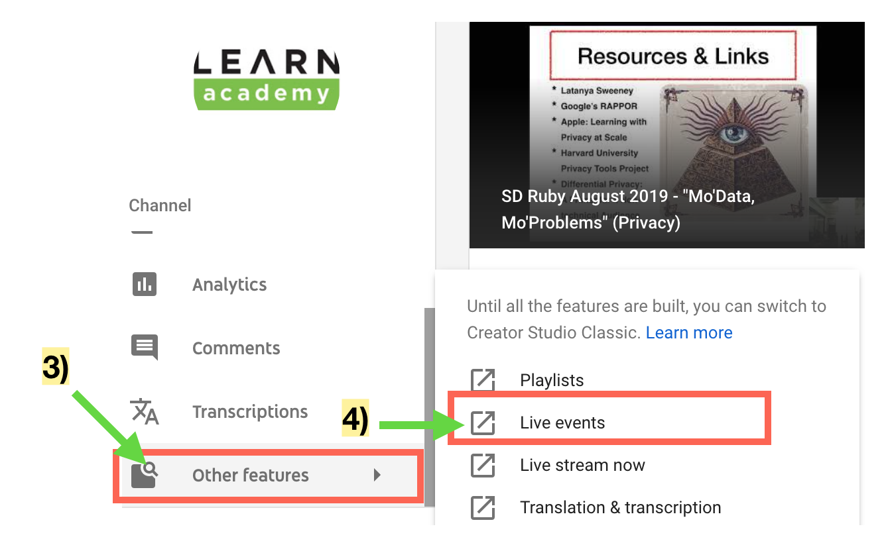
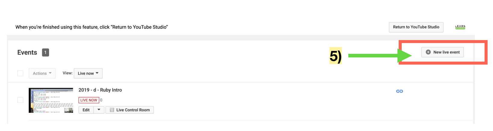
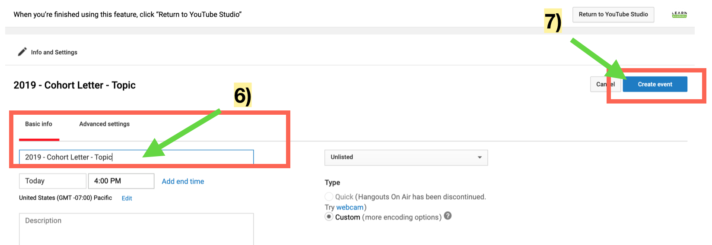
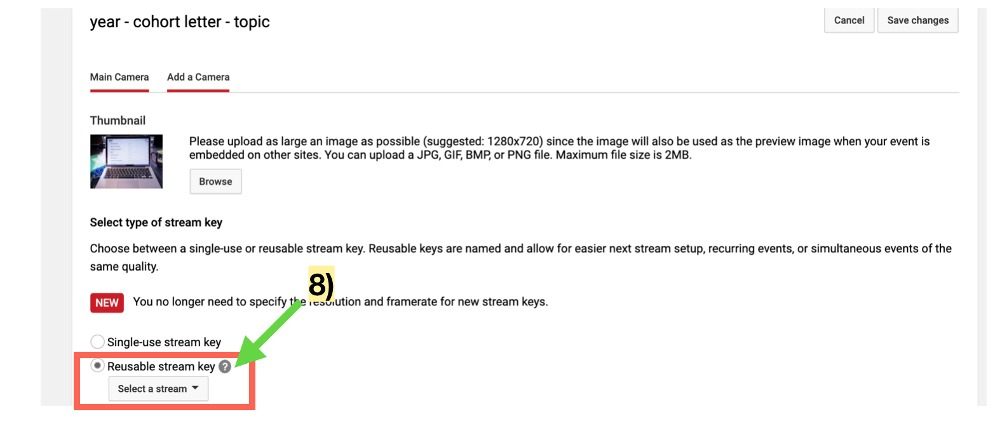
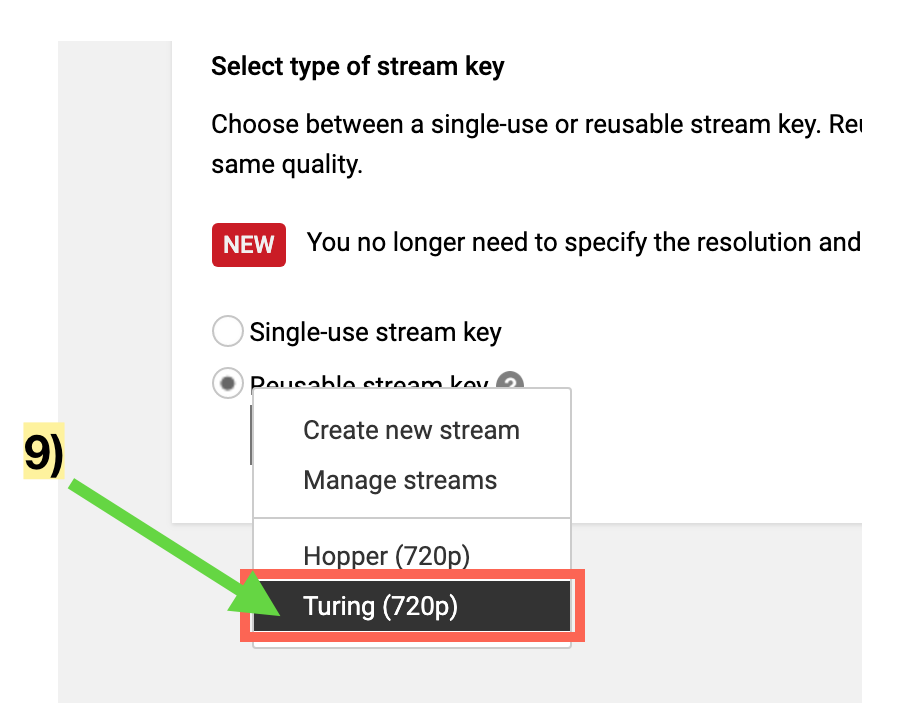

# Capturing Lessons Using Youtube Live Events

LEARN utilizes Youtube Live Events to record lessons. Youtube Live Events lets you set up a live stream that you can capture and share.

## Setting Up a Stream

A breakdown follows of the steps to creating a Live Event.

### Sign In

- Use your LEARNAcademy credentials on Google to sign in to Youtube
- Once you are signed in, clicking your avatar at the top right of the Youtube screen should reveal a menu
- Find and click the  **Switch account** tab and select **LEARN academy**

When you see the LEARNAcademy logo as your avatar you are signed to LEARNAcademy's Youtube channel.

### Setting Up and Recording a Live Event

1) Click the LEARNAcademy avatar
2) Click **Youtube Studio (beta)** in the menu. When the page is done refreshing, the Youtube logo changes to Studio beta

3) Scroll down in the left navigation menu under channel until you see **Other Features** and click the tab
4) Select **Live events**

5) Click the **+ New live event** button at the top right

6) Add a title to the video using this template `year` - `cohort` - `topic`
7) Click the **Create event** button on the top right

8) Click **Select a stream**

9) Select the room you are in (**Hopper** or **Turing**), it should save on it's own

10) If **STREAM STATUS** is **GOOD**, you are ready to stream and you can click **Preview** to test the stream
11) Once the preview is working you have the option to click **Start recording** to start capturing the lesson
12) When the lesson is finished, remember to click **Stop recording**

## Monitoring the Stream

It is often very helpful for an additional instructor to be present to both start and monitor the stream.

### OBS: Open Broadcaster Software

In each classroom there is at least one machine that has the OBS software installed. This software is what allows us to capture the stream and feed it to Youtube.

#### The OBS Interface

The OBS interface looks like this:

1) The currently casting stream
2) Scene menu
3) Sources menu
4) Mixer
5) Scene Transition Menu
6) Control buttons

#### OBS Remote: Controlling Cast

There are 2 possible views to cast during a lesson. There is the **speaker** view and the **presentation** view. While it is often the case that we can simply cast the presentation accompanied witht the speaker's voice, there are times when it is helpful to toggle between the speaker and their presentation. This is true for example when the speaker is using the whiteboard.

The control interface really just a web page with buttons to switch between the available views and there is a page for each room:

**TURING**: http://t2t2.github.io/obs-tablet-remote/#!auto&host=10.0.1.3

**HOPPER**: http://t2t2.github.io/obs-tablet-remote/#!auto&host=10.0.1.2 

To get to the control panel:

- Visit the link to the appropriate room
- Click the **Connect** button in the prepopulated *Connect* form on the page. It will take you to control screen 
- As you click the buttons to switch your cast, the casting stream window in the OBS Desktop application will reflect which you are currently casting

**Note**: At times it is easier to get to the control panel on a mobile web browser
