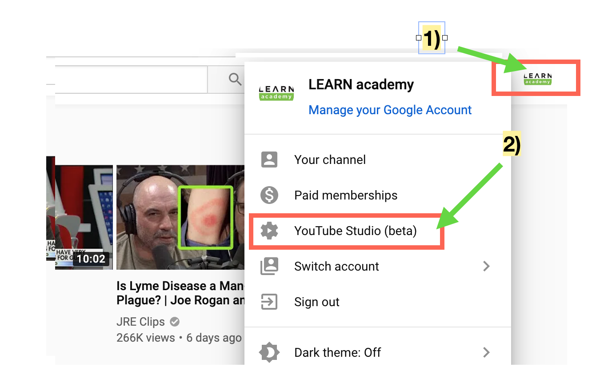

# Capturing Lessons Using Youtube Live Events

LEARN utilizes Youtube Live Events to record lessons. Youtube Live Events lets you set up a live stream that you can capture and share.

## Setting Up a Stream

A breakdown follows of the steps to creating a Live Event.

### Sign In

- Use your LEARNAcademy credentials on Google to sign in to Youtube
- Once you are signed in, clicking your avatar at the top right of the Youtube screen should reveal a menu
- Find and click the  **Switch account** tab and select **LEARN academy**

When you see the LEARNAcademy logo as your avatar you are signed to LEARNAcademy's Youtube channel.

### Setting Up and Recording a Live Event

1) Click the LEARNAcademy avatar
2) Click **Youtube Studio (beta)** in the menu. When the page is done refreshing, the Youtube logo changes to Studio beta

3) Scroll down in the left navigation menu under channel until you see **Other Features** and click the tab
4) Select **Live events**

5) Click the **+ New live event** button at the top right

6) Add a title to the video using this template `year` - `cohort` - `topic`
7) Click the **Create event** button on the top right

8) Click **Select a stream**

9) Select the room you are in (**Hopper** or **Turing**), it should save on it's own

10) If **STREAM STATUS** is **GOOD**, you are ready to stream and you can click **Preview** to test the stream
11) Once the preview is working you have the option to click **Start recording** to start capturing the lesson
12) When the lesson is finished, remember to click **Stop recording**
