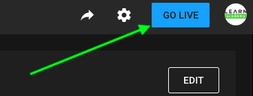

# Capturing Lessons Using Youtube Live Events

LEARN utilizes Youtube Live Events to record lessons. Youtube Live Events lets you set up a live stream that you can capture and share.

## Setting Up a Stream

A breakdown follows of the steps to creating a Live Event.

### OBS: Open Broadcaster Software

In each classroom there is at least one machine that has the OBS software installed. This software is what allows us to capture the stream and feed it to Youtube. Start OBS by clicking on it in the dock on the streaming computer.

You don't have to click on very many things in OBS in order to set up a stream
- In the bottom right hand corner, you'll see "Start Streaming" and "Start Recording"
- "Start Streaming" should be used when you are recording a lecture, in-class speaker, etc. Click this button **first** before moving on to the next steps in YouTube.
- "Start Recording" should be used for _student_ presentations. All you have to do to use this option is click "Start Recording" then "Stop Recording" when they're done presenting. This will save a thumbnail on the desktop that you can send to students directly. This option is used to avoid students appearing on the LEARN YouTube account.

#### The OBS Interface

The OBS interface looks like this:

The panels important to monitoring are outlined:

1) Current stream view
2) Sources list
3) Mixer

**Current stream view**

This is a live monitor for the video that is streaming. The [OBS Remote](#obs-remote:-controlling-cast) section below describes how you can switch between the **Desktop**, **Speaker**, and **Split** views.

**Sources list**

This panel lists all the sources of the stream. Generally you want to be sure that the **webcam video**, **wireless(mic)**, and **webcam(mic)** are online. 

**Mixer**

Use this panel to make sure that the **wireless mic** is receiving a strong signal. A strong signal is a green to lower/mid yellow band. You may also use the full-size mic if you'd like. You can even use both mics at the same time for multiple speakers.

### Sign in to YouTube

- Use your LEARNAcademy credentials on Google to sign in to Youtube
- Once you are signed in, clicking your avatar at the top right of the Youtube screen should reveal a menu
- Find and click the  **Switch account** tab and select **LEARN academy**

When you see the LEARNAcademy logo as your avatar you are signed to LEARNAcademy's Youtube channel.

### Setting Up and Recording a Live Event

1) Click on the icon in the top right-hand corner that looks like a video camera with a "+" inside of it

2) Now click "Go Live"

3) A box will show up in the middle of the screen. You will want to click on "Copy and Create" to start a new stream. This will copy the format from the previous stream
4) From here, change the name of your current stream using the format below ( Year - Cohort - Topic) so that videos are organized properly

5) Double check that you are recording in the correct room

6) Wait for about 30 seconds until the video loads in YouTube Studio. Once you see the live screen, you are good to click "Go Live" in the top right-hand corner to officially start the stream

7) When the you're done recording, don't forget to click "Stop" in YouTube Studio
8) Now you will have access to the link to your video that you can share

## Monitoring the Stream

It is often very helpful for an additional instructor to be present to both start and monitor the stream.

